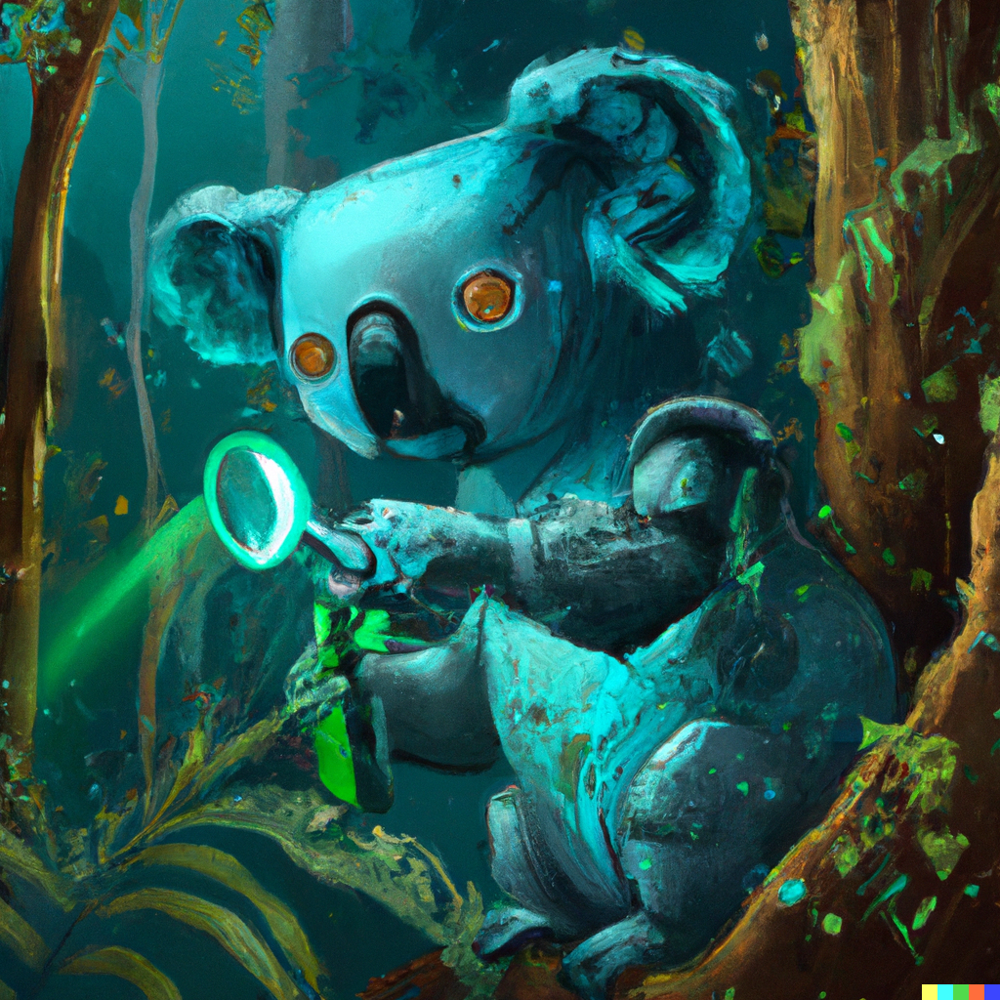

# marsupial

Detect and identify animals in camera traps, up to 1370 times faster than manually, using the power of AI.




## The Problem:

Camera traps take motion-triggered pictures of animals in their natural environment, and are the most cost-effective, non-invasive method of monitoring wildlife species. However, after collecting the images, a significant amount of time is spent labelling the species which are present in each image. It is estimated that single-species image labelling can be done at 450 images/hour by experts and around half that rate for citizen scientists  which would equate to ~4 person-years per million labelled images. For example – in the WildCount data set we have used for training, 6 years of data (2.16 million labelled images) equates to 9600 hours, or 8 person-years to label. 

## The Solution: Marsupial

Automate! Computer-vision object detection has come a long way in the recent past. We have trained a state-of-the-art object detection model on the WildCount data set  - which includes 157 species across 252 sites and 8 years, in 2.16 million labelled images - with the following preliminary results on held-out validation data:

- The 33 most common species are correctly identified with 94% precision and 93% recall
- The 71 most common species are correctly identified with 88% precision and 84% recall
- Correctly detecting presence/absence of an animal in an image with 93% precision and 92% recall. 

And the solution is really fast. It can label:
- 12 thousand images per hour on a laptop (CPU), or 
- 300 thousand images per hour on a standard cloud-provider GPU solution – costs around $5/hr - so it would take 7 hours to relabel the entire 2.16 million labelled images in the WildCount data set.


### Interactive Workflow (Google Colab)

For a detailed interactive demonstration of the workflow, check out the [Google Colab](https://colab.research.google.com/drive/1YQ1ck-3HQKToAZ5DwQKy5xamDsck7KTL?usp=sharing) jupyter notebook. 

### Basic Instructions (MacOS/Linux)

These steps should work for any MacOS or Linux system. 
They should also work for Windows systems if you have correctly installed a conda version on your system and have added it to your PATH, but I have not tested these specific steps on a Windows device.

1. Create a conda environment for our project, with Python 3.9.
 
```bash
conda create -n marsupial python=3.9
conda activate marsupial
```

2. Install requirements.

```bash
pip install gradio torch pandas numpy torchvision wandb jupyterlab kaggle
```

3. Train model

```bash
python train.py --img 640 --batch 64 --epochs 300 --data marsupial.yaml --weights yolov5s.pt
```

4. Evaluate model performance

```bash
python val.py --data marsupial.yaml --task "val"
```

5. Make predictions

```bash
python detect.py --source "image_dir/" --weights <your fitted weights>
```


### Methods

#### Data Preperation

[UNDER CONSTRUCTION]

To improve model performance on out of sample data, I used 90 degree rotational augmentation. This saved duplicate versions of each image for 90, 180, and 270 degree rotations. I then split the data into 85% training, 10% validation, and 5% testing.

Model Training
An object detection model was then fine tuned on this dataset. I used the Python implementation of Ultralytics' YOLOv5, and fine tuned from the YOLOv5s.pt checkpoints. Fine tuning used stock hyperparameters, with an image size of 640p, batch size of 64 for 300 epochs.

Prototyping was done in a Jupyter Notebook on a Google Colab Free Tier GPU Virtual Machine equipped with an NVIDIA T4 GPU. Based on prototype performance, a fulle 300 epoch training with a batch size of 16 would take approximately 5 hours and 15 minutes. This is well within the Google Colab Free Tier GPU usage limitations.

The final model was trained on the University of Sydney's Artemis high performance computer, using one NVIDIA V100-SXM2-16GB GPU, 36 Intel Xeon Gold 6140 2.30GHz CPU cores, and 64 GB of RAM mounted in a Dell EMC PowerEdge C4140 server. Training stopped early after 3 hours and 34 minutes, as model performance had peaked at epoch 44 and had not improved for 100 epochs. Model and system performance were monitored and assessed using Weights & Biases.
